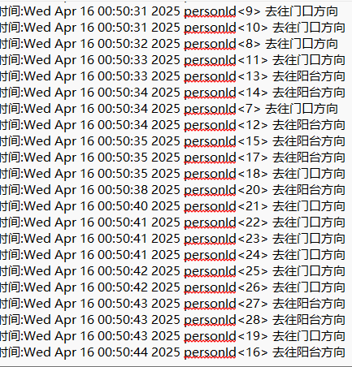

# Luckfox Pico RKMPI YOLO HUMAN TRACKER

+ This example is based on RKMPI and Opencv-Mobile for image encoding and streaming.
+ This example uses RKNN for image recognition inference.
+ Human flow detection and capture

人流量检测和捕捉

## 演示


## 支持环境

目前只测试了 Luckfox Pico Ultra W RV 1106

以下luckfox开发板保证支持的只有Luckfox Pico Ultra和Luckfox Pico Ultra W，其他不敢保证，但是做一下适配应该问题不大
+ **RV1103**:`Luckfox Pico` `Luckfox Pico Mini A` `Luckfpx Pico Miini B` `Luckfox Pico Plus`
+ **RV1106**:`Luckfox Pico Pro` `Luckfox Pico Max` `Luckfox Pico Ultra` `Luckfox Pico Ultra W`

## 编译
+ 交叉编译环境

    项目目录下的arm-rockchip830-linux-uclibcgnueabihf就是armv7l交叉编译包
    来自luckfox_pico官方sdk
    需要可以自行获取
    ```
    git clone https://gitee.com/LuckfoxTECH/luckfox-pico.git
    ```
+ 编译
    ```
    mkdir build
    cd build
    cmake ..
    make install
    ```
    会在install目录下生成luckyolo执行包

## 运行
+  编译后会在install目录下生成luckyolo执行包
    ```
    install
       |
       --luckyolo
            |
            --lib 动态库文件目录
            --luckyolo 可执行文件
            --models 模型文件和labels文件目录
    ```
+ 将生成的部署文件夹上传到Luckfox Pico（使用adb、ssh等）。在开发板上，进入该文件夹

    我们要创建存放人流量数据的`history.txt`和`images`目录
    ```
    nano history.txt 使用ctrl+s加ctrl+x退出
    mkdir images
    ```
    在Luckfox Pico板上，luckyolo是部署文件夹中的可执行程序
    ```
    chmod a+x luckyolo
    ./luckyolo
    ```
    ** 注意：** 请勿更改部署文件夹的结构。
+ 使用SLC打开网络流`rtSP：//<your_ip>/live/0 `（根据需要调整IP地址以检索图像）

识别到新的personId会把图写入images，当一个personid消失会把它写入history.txt




## web端演示

+ 没有做什么高大上的界面和功能(后续可能优化)
    将web文件夹上传到Luckfox Pico（使用adb、ssh等）。在开发板上，进入该文件夹
    
    编辑web.py，修改`HISTORY_FILE`和`IMAGES_DIR`，修改为luckyolo文件夹下的`history.txt`和`images`
    ```
    nano web.py

        HISTORY_FILE = "../luckyolo/history.txt"
        IMAGES_DIR = "../luckyolo/images"

    ```
    随后启动
    ```
    python web.py
    ```
    浏览器访问`http://<your_ip>:8080`即可


## Detail
项目基于[RKMPI Instance User Guide](https://wiki.luckfox.com/Luckfox-Pico/Luckfox-Pico-RV1106/Luckfox-Pico-Ultra-W/Luckfox-Pico-GPIO/RKMPI-example)
